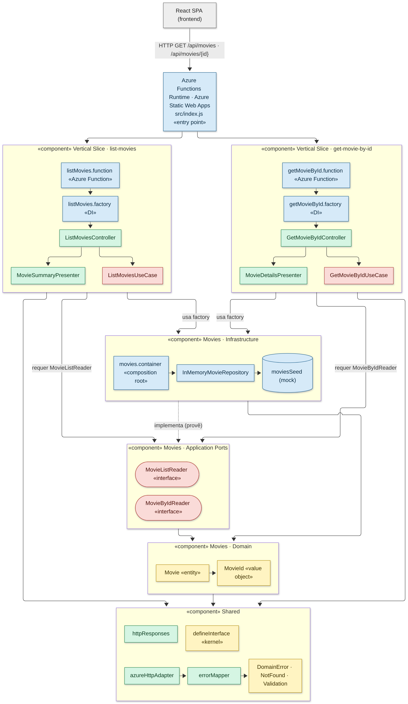
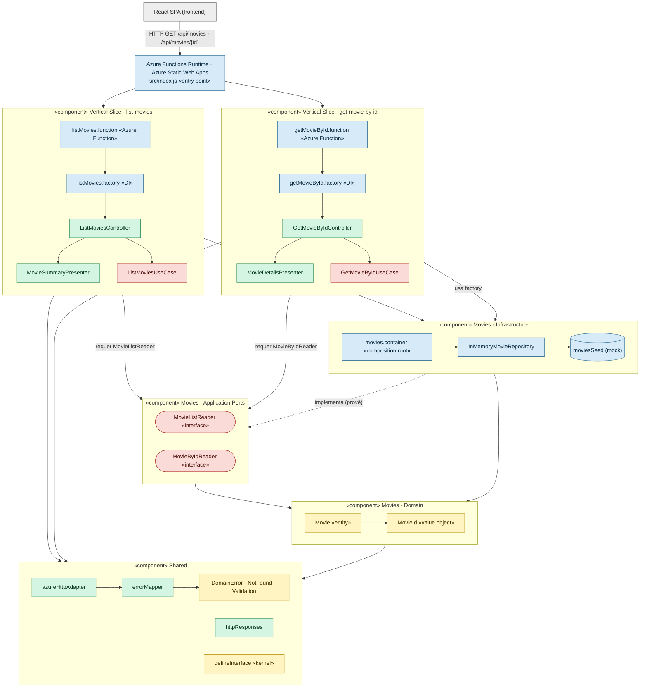
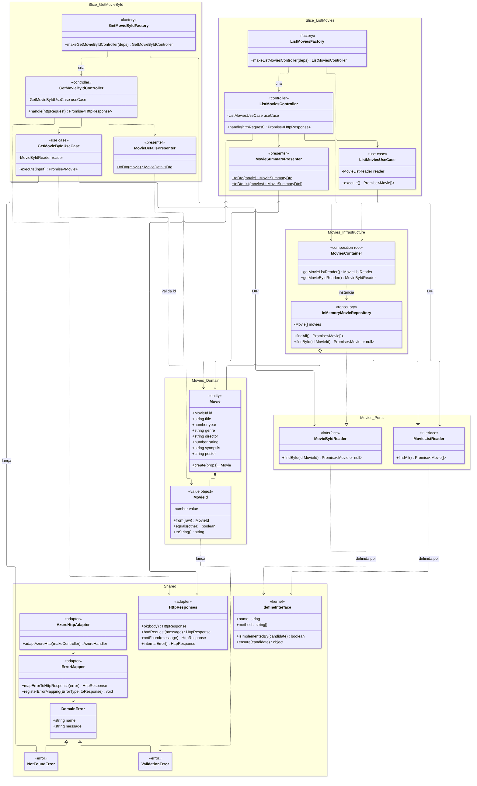
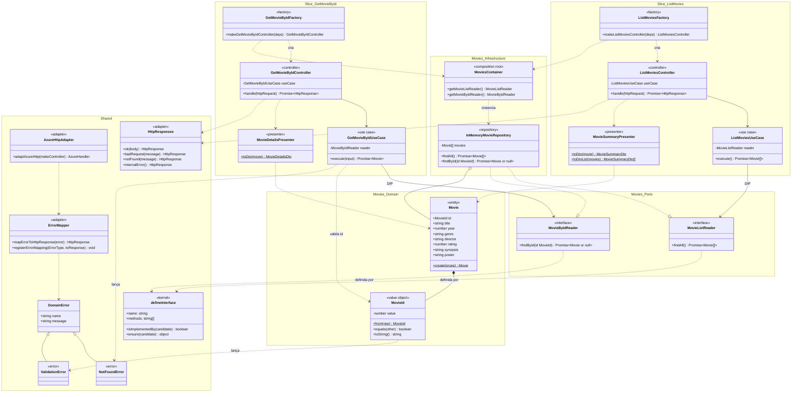

# Arquitetura do Backend — Vertical Slice + Clean Architecture + SOLID

Backend do **MovieHub** (Azure Functions, Node.js v4) refatorado com apoio de IA Generativa.
Os diagramas abaixo estão em **Mermaid** (renderizam direto no GitHub) e também como imagem
(`.png` e `.svg`) nesta mesma pasta.

## Legenda de cores (camadas da Clean Architecture)

| Cor | Camada | Exemplos |
|---|---|---|
| 🟨 Amarelo | **Domain** (Entities) | `Movie`, `MovieId`, `DomainError` |
| 🟥 Vermelho | **Application** (Use Cases + Ports) | `ListMoviesUseCase`, `MovieListReader` |
| 🟩 Verde | **Interface Adapters** | Controllers, Presenters, `azureHttpAdapter`, `errorMapper` |
| 🟦 Azul | **Frameworks & Drivers** | `*.function.js`, factories, `InMemoryMovieRepository` |

## Estrutura de pastas

```
api/src
├── index.js                                   # entry point: registra as slices
├── shared/                                    # Shared Kernel (usado por todas as slices)
│   ├── kernel/defineInterface.js              # contrato de interface (portas)
│   ├── domain/errors/                         # DomainError, NotFoundError, ValidationError
│   └── http/                                  # azureHttpAdapter, errorMapper, httpResponses
└── modules/movies/
    ├── domain/                                # Movie (entity), MovieId (value object)
    ├── application/ports/                     # MovieListReader, MovieByIdReader (interfaces)
    ├── infrastructure/persistence/            # InMemoryMovieRepository + moviesSeed (mock)
    ├── movies.container.js                    # composition root do módulo
    └── features/                              # ← VERTICAL SLICES
        ├── list-movies/                       # GET /api/movies
        │   ├── listMovies.function.js         #   Frameworks & Drivers
        │   ├── listMovies.factory.js          #   Injeção de dependência
        │   ├── ListMoviesController.js        #   Interface Adapter
        │   ├── MovieSummaryPresenter.js       #   Interface Adapter
        │   └── ListMoviesUseCase.js           #   Application
        └── get-movie-by-id/                   # GET /api/movies/{id}
            ├── getMovieById.function.js
            ├── getMovieById.factory.js
            ├── GetMovieByIdController.js
            ├── MovieDetailsPresenter.js
            └── GetMovieByIdUseCase.js
```

## Diagrama de Componentes





## Diagrama de Classes





## Regra de dependência

```
Frameworks & Drivers  ──►  Interface Adapters  ──►  Application  ──►  Domain
 (*.function, factory,      (Controller,             (UseCase,        (Movie,
  InMemoryRepository)        Presenter, adapter)      Ports)           MovieId)
```

As setas de código-fonte apontam sempre **para dentro**. O domínio e os casos de uso não
importam `@azure/functions` nem conhecem a origem dos dados. O repositório (camada externa)
**implementa** as portas definidas na camada de aplicação — inversão de dependência.
